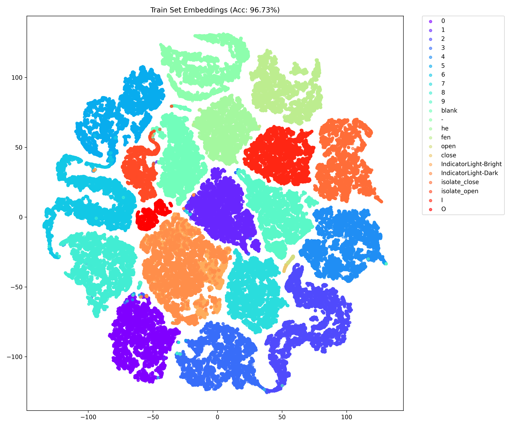

# Complex Lighting Status Detection with Siamese Networks
# 复杂光照环境下的状态标签检测系统

这是一个基于 **孪生网络 (Siamese Network)** 和 **度量学习 (Metric Learning)** 的计算机视觉项目。

本项目旨在解决工业或设备场景下，**复杂光照条件**（如强反光、暗光、阴影）下的状态标签识别问题。通过将图片映射到高维特征空间，利用对比损失（Contrastive Loss）或三元组损失（Triplet Loss）拉近同类距离、推开异类距离，从而实现高精度的分类。

## 📌 项目特点

* **鲁棒性强**：专门针对复杂光照设计，通过 `ColorJitter` 和 `RandomAdjustSharpness` 进行强力数据增强，模拟现实世界的恶劣环境。
* **度量学习架构**：支持 **Siamese Network (孪生网络)** 和 **Triplet Network (三元组网络)** 两种架构。
* **高效骨干网**：基于预训练的 **ResNet-18**，去除全连接层并添加 L2 归一化嵌入层 (128维)，兼顾速度与精度。
* **可视化分析**：提供 t-SNE 和 PCA 可视化工具，直观展示特征在空间中的分布情况。

---

## 📂 支持的检测类别

目前模型支持以下 **27 类** 状态标签的检测：

* **数字**: `0`, `1`, `2`, `3`, `4`, `5`, `6`, `7`, `8`, `9`
* **符号**: `blank` (空), `-` (减号)
* **汉字**: `he` (合), `fen` (分)
* **英文**: `open`, `close`
* **指示灯**: `IndicatorLight-Bright` (亮), `IndicatorLight-Dark` (灭)
* **刀闸状态**: `isolate_open` (分闸), `isolate_close` (合闸)
* **IO 标识**: `I`, `O`

---

## 🛠️ 目录结构

```text
.
├── datasets/               # 数据集根目录
│   ├── 0/                  # 类别文件夹
│   ├── 1/
│   ├── ...
│   └── open/
├── saved_models/           # 存放训练好的模型权重 (.pth)
├── test_images/            # 存放用于单张测试的图片
│   └── img.jpg
├── datasets.py             # PyTorch Dataset 定义 (Siamese/Triplet 数据对构建)
├── losses.py               # 损失函数 (ContrastiveLoss, TripletLoss)
├── networks.py             # 网络结构 (ResNet18 Embedding Net)
├── main.py                 # 训练主程序
├── test_model.py           # 模型评估与可视化 (生成散点图)
├── test_model0.py          # 单张图片推理与批量准确率测试
├── metrics.py              # 评价指标
└── README.md               # 项目说明文档

